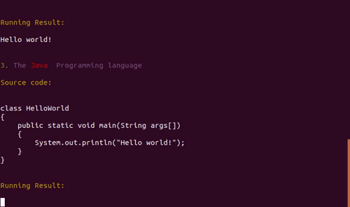

# Hello world for all languages
Simple “hello world” collections for programming languages

# Build and Run


## Build
```
docker build --rm -f "Dockerfile" -t helloworld:latest "."
```

## Run
```
docker run --rm -it  helloworld:latest
```

## Pull

```
docker pull calidion/helloworld
```

# Demo



